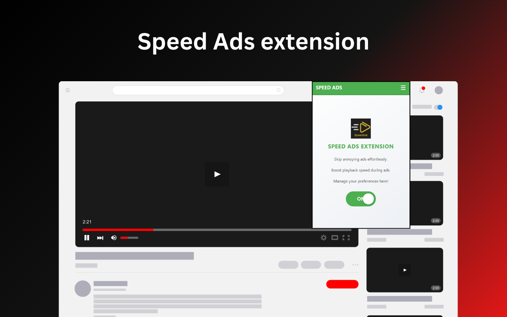

# Speed Ads Chrome Extension 🚀

## Overview

Speed Ads is a Chrome extension designed to enhance your YouTube experience by automatically skipping ads and boosting video playback speed during advertisements. It gives users greater control over their media consumption and ensures a smoother, uninterrupted viewing experience. 😎

---

## Features

- **Ad Skipping** ⏭️: Automatically skips YouTube ads.
- **Playback Speed Boost** ⚡: Sets playback speed to 16x during ads and restores your preferred speed after ads.
- **User Preferences** 🔧: Toggle the functionality on/off through an intuitive interface.

---

## Usage

1. Click on the Speed Ads icon in your Chrome toolbar to open the popup.
2. Toggle the feature **ON/OFF** using the switch.
3. Enjoy an enhanced YouTube experience with ads skipped and playback speeds adjusted! 🎉

---

## Screenshots

### Popup Interface

*Note: Place your screenshot images in the `screenshots` folder in your repository or update the paths accordingly.*

---

## Browser Extension Links

- **Chrome**: Install Speed Ads from the [Chrome Web Store](https://chromewebstore.google.com/detail/speed-ads/bdolpphpmkmjmgafmipimhfemconnfgb) 🚀
- **Firefox**: Install Speed Ads from [Mozilla Add-ons](https://addons.mozilla.org/en-US/firefox/addon/speed-ads/) 🦊

---

## Contributing

Contributions are welcome! Please fork the repository and submit a pull request with detailed explanations of your changes. 🤝

---

## License

This project is licensed under the MIT License - see the [`LICENSE`](LICENSE) file for details. 📜

---

## Author

- **Amit Das**
  - [GitHub](https://github.com/AmitDas4321)
  - [Facebook](https://www.facebook.com/AmitDas4321)
  - [Instagram](https://www.instagram.com/amitdas4321)

---

## Feedback

If you encounter any issues or have feature requests, feel free to open an issue or contact me directly! 💬
